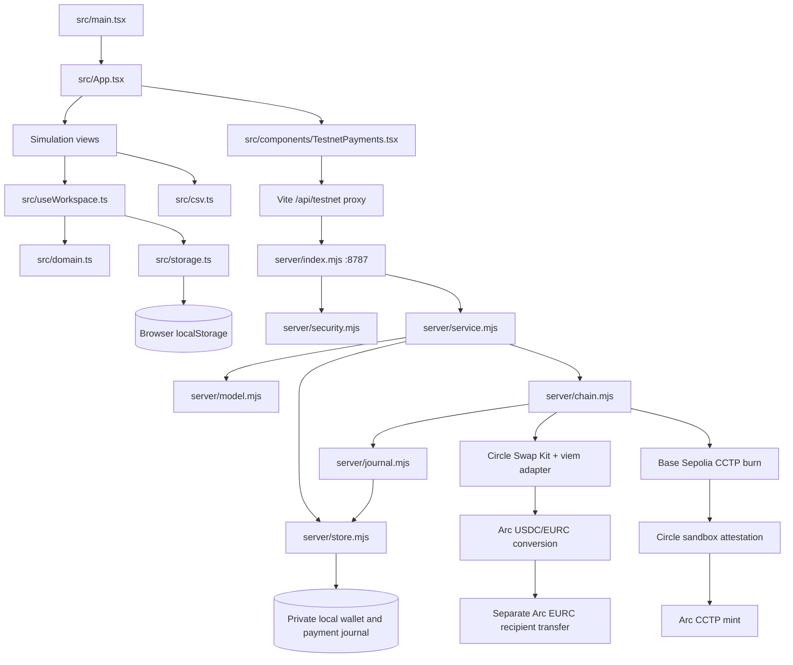

# Clearline project map and status

Original review: 2026-09-27 against source, installed SDK declarations, sanitized local payment metadata, and tests/build. The dated onchain evidence below is historical; the October update records current changes and checks.

Updated 2026-10-01 for the UI refresh, hosted quote-endpoint fix, corrected public-SDK stop-limit units, intermittent quote-route recovery, and hosted conversion checkpoint fix. Current checks: **76 unit tests passed; frontend build passed**. Synthetic testnet UI smoke and simulator browser smoke passed for the preceding UI/quote update. The UI smoke covers plain-text HTTP 500 responses, payment-level route errors in HTTP 202 responses, successful retry/error clearing, quote expiry, payment creation/selection, pending quote spinner feedback and cleanup, desktop/mobile layouts, and automated WCAG A/AA checks across workspace pages, testnet details/form, landing and proof pages. It intercepts all testnet requests and approves no onchain action. The September transaction proofs below were not rerun.

**Hosted conversion checkpoint correction:** the unbound `store.save` callback used `this.state`, producing `Cannot read properties of undefined (reading 'state')` after transaction signing but before journal broadcast. The callback now closes over its store, snapshots each checkpoint immutably, serializes Turso writes, and returns the persistence promise. The journal awaits both pre-broadcast and submitted checkpoints, preserves signed entries on persistence failure, and re-checkpoints the same bytes on recovery. Chain receipt/legacy-label/retry-counter saves are awaited; the final handler save uses the same queue instead of racing a direct write. Seven new regressions cover the exact callback failure, async checkpoint gating/errors, ordering, signature-preserving recovery, and authenticated handler → real chain adapter → mocked DB/RPC execution. The handler fixture verifies receipt-derived EURC output, final converted persistence, and public raw-byte stripping; a callback mutation reproduced the user's exact error before the fix passed. These are synthetic boundary checks, not new live conversion/payout or database fault proof.

**Stop-limit correction:** `8a5f400` confused the provider's base-unit contract with the public Swap Kit contract. The installed SDK's `resolveSwapConfig` converts human-readable `config.stopLimit` into output-token base units. Passing a stored minimum of `2455668` directly emitted `2455668000000` to Circle, a million-times-too-large floor. The app now passes `2.455668` to public Swap Kit so Circle receives exactly `2455668`; stored quotes and receipt verification remain integers. Three HTTP-boundary tests exercise the real installed `SwapKit.swap` through parameter resolution and deliberately stop at a rejected provider response before approval/signing. They cover the 3-USDC case, a sub-EURC floor and one micro-EURC; the previous mocked test incorrectly reinforced the bug.

Read-only live preparation checks also accepted a 3-USDC request with `stopLimit=2447149` at the unchanged 100 bps (2.473814 EURC estimated, 2.447149 minimum). Identical correctly formed requests also returned route/slippage errors before succeeding. An absolute-floor-only diagnostic also failed intermittently, so no conflict between the two fields was established and the production 100-bps setting was preserved. This verifies request formation and estimate acceptance, **not actual conversion/payout**; no chain transactions were approved. [Circle's public configuration example](https://github.com/circlefin/skills/blob/master/plugins/circle/skills/swap-tokens/references/slippage-fees.md) likewise uses human-readable stop limits.

A fresh read-only Circle quote probe for the hosted wallet reproduced the user's 3-USDC error: two identical requests returned HTTP 404 “No route available”; the third succeeded at the unchanged 100-bps limit (2.480473 EURC estimated, 2.455668 minimum). This establishes intermittent provider availability for that amount, not guaranteed liquidity or execution. `server/chain.mjs` adds one estimate-only retry after the SDK's three HTTP attempts, specifically for error code 1003 with “No route available”; a persistent failure stops with amount-specific recovery guidance. It does not widen slippage, split payments, sign transactions, or retry swaps/payouts. HTTP-fixture tests run the installed SDK through its real wire request, base-unit conversion, and error parsing. Slippage guidance no longer claims funds were untouched without receipt evidence.

A separate baseline hosted check on deployment `8a5f400` created one isolated diagnostic obligation for 3 USDC, received a live quote (2.473494 EURC expected; 2.448759 minimum), and verified it persisted on reload with zero transactions. This confirms the previously deployed quote handler can succeed intermittently; it is not proof of the new retry deployment or of conversion/payout execution.

The repo now includes Vercel `api/` handlers, Turso persistence in `server/db.mjs`, a landing page and a public proof page. The quote handler previously failed during module import because its auth and store imports pointed to nonexistent paths; both paths are corrected and covered by credential-free handler tests. Public source is tracked in Git again.

## Where we are

**Dark mode (2026-10-02):** a sun/moon control appears on Home, proof and workspace headers. The initial HTML selects `clearline.theme.v1` before rendering, with the device preference as the default. `ThemeToggle.tsx` persists explicit choices without touching payment records; `theme.css` supplies a forest/sage palette for all pages, forms, dialogs, statuses, receipts and hover states. The 76 unit tests, frontend build, homepage, synthetic UI and simulator checks passed. `scripts/theme-browser-smoke.mjs` additionally verifies preference persistence/defaults, dark walkthrough stages, desktop/mobile layouts, payment drawer/forms, proof, synthetic testnet quotes/receipt links/nonselected-row hover, loading/reduced motion and automated WCAG A/AA audits. Checks used isolated browsers and synthetic funds/responses; no chain action was approved.

**Homepage learning guide (2026-10-01):** an editorial home page replaces the technical feature grid with a plain-language introduction, an invoice/currency/payment illustration, and an embedded interactive walkthrough. `PaymentWalkthrough.tsx` teaches invoice creation → demo funding → approved conversion → recipient payment → matching. Three source presets use `bigint` and the existing money formatter, a fixed illustrative 0.915 rate, and an additional 0.25-USDC fee; a money tracker shows wallet/recipient balances and a receipt shows the matched invoice. Local component state supports back/reset and resets on leaving Home. It makes no API calls and does not change simulation or testnet records. Its recipient-send stage is a conceptual preview, not new external payout functionality in the simulation workspace. FAQs explain terms and the current variable-output limitation. Home still links to simulation, testnet and dated proof. The dedicated browser smoke verifies the full journey for all amounts, exact output, matching without balance changes, workspace/API isolation, keyboard use, responsive layouts and automated WCAG A/AA audits. The 76 unit tests, frontend build, existing synthetic UI checks and simulator browser checks also passed; no new chain transactions were approved.

| Area | Implemented | Evidence / remaining boundary |
| --- | --- | --- |
| Simulation | Dashboard, obligation/CSV intake, quote/approval, exceptions, ledger, reconciliation/export, local persistence | 23 simulator/IO tests pass; earlier browser checks recorded in `BUILD_LOG.md` |
| Testnet frontend | Wallet balances, funding selection, quotes, stage actions, receipt links, CSV export | Direct Arc and crosschain payments exercised through UI; desktop/mobile, export, reload and duplicate rejection checks pass |
| Testnet server / hosted checkpoints | Local signer, JSON disk state, request safeguards, serialized local actions, async-aware signed-transaction journal | 45 testnet tests pass, including installed SDK boundaries, exact swap-minimum wire units, quote recovery, hosted save ordering and authenticated synthetic recovery |
| CCTP funding | Direct contract approval/burn, attestation, mint, receipt accounting, explicit reverted-stage retry | Verified one 1-USDC Base burn, Circle attestation and one 1-USDC Arc mint; no duplicate burn |
| USDC → EURC | Circle Swap Kit estimate/swap via viem adapter | Verified direct route 0.822060 EURC and crosschain route 0.822252 EURC from 1 USDC each |
| Recipient payout | Exact EURC ERC-20 transfer and receipt verification | Both exact EURC outputs paid to local test recipient; both invoices reconciled |
| Real pilot | Not implemented | Production custody, auth, shared accounting, deployment and operational validation remain |

September 27 checks: **54 tests passed; TypeScript/Vite production frontend build passed; simulator and testnet browser checks passed**. Independent RPC proof is in [TESTNET_PROOF.json](TESTNET_PROOF.json), generated by `node scripts/verify-testnet.mjs`. The server JavaScript is outside the frontend TypeScript build.

`ARC-PROOF-001` is now `reconciled`: 1 USDC source, 0.813844 EURC minimum, 0.822060 EURC actual and paid output. The initial 20 Arc USDC became 18.982572 USDC after the payment and fees. The user subsequently funded 20 Base Sepolia USDC and 0.001 test ETH. `CCTP-PROOF-001` is also `reconciled`: one 1-USDC source burn → 1 USDC minted on Arc → 0.822252 EURC converted and paid, above its 0.813463 EURC minimum. All six receipts for that route independently verified. Final balances: 18.963038 Arc USDC, 0 Arc EURC, 19 Base USDC and 0.000998997742905892 Base ETH. Standard attestation took approximately 24 minutes. A direct-Arc record still starts in `funded` without validating sufficient wallet balance; rely on RPC/receipts, not that label.

Public proof links: [successful swap](https://testnet.arcscan.app/tx/0x9d84d0576c190534b46f2b256f9ad883e3faab28584bd809e2c74f209083183b), [recipient payout](https://testnet.arcscan.app/tx/0xb557b9a922edfd1ca267246bba9083083399a4d43bee010f22e64d33750bb30a). The first approval-only attempt was recovered across server restart without repeating its transaction; its hash remains in the ledger. These rates describe test-pool execution, not market FX.

Crosschain proof links: [Base burn](https://sepolia.basescan.org/tx/0x1b5e955ed53db1d408fa2a85cb703f0bc3e92d8c5e1c390b6ef749d4c26021ee), [Arc mint](https://testnet.arcscan.app/tx/0x923c36c1350cc7f5ad9c37d286ac18164cc9fd1ab8dd397faca09f95e456bc17), [swap](https://testnet.arcscan.app/tx/0x651c524597c6eb10dbb4a33bd0cdf39668d62ee28b430aca44875b791983c89a), [recipient payout](https://testnet.arcscan.app/tx/0xd205320e3092980f42dfe5dfb884fccd3468db3084b9f99883237d9f189f50d3). CCTP charged zero token fee for this transfer; network gas and the swap provider fee were separate.

## Architecture



The diagram depicts the local execution path, which uses disk persistence; hosted handlers use Turso through `server/db.mjs`. Concrete completed transactions are recorded separately in the proof file. There is no custom Solidity contract, StableFX API integration, direct Uniswap SDK integration, or bank payout integration in this workspace. `@circle-fin/bridge-kit` is installed but the actual bridge implementation calls CCTP contracts directly.

## File and responsibility map

| File / directory | Responsibility |
| --- | --- |
| `src/main.tsx` | React mount, font and CSS imports |
| `src/App.tsx` | Navigation, simulation workspace views, testnet entry |
| `src/domain.ts` | Exact money, seed state, pure simulator transitions and ledger |
| `src/useWorkspace.ts` | Simulation mutation/persistence boundary, damaged/stale storage handling |
| `src/storage.ts` | Simulation saved-state validation |
| `src/csv.ts` | Obligation CSV parsing, ledger export and download helpers |
| `src/components/Overview.tsx` | Simulation metrics/charts |
| `src/components/PaymentTable.tsx` | Simulation queue, filters and pagination |
| `src/components/PaymentForms.tsx` | Simulation creation/import/funding forms |
| `src/components/PaymentDetails.tsx` | Simulation quote, approval, recovery, timeline and reconciliation |
| `src/components/ui.tsx` | Shared dialogs and display helpers |
| `src/components/TestnetPayments.tsx` | Polls API every 2.5 seconds; testnet actions/export |
| `src/testnet-api.ts` | Shared JSON response parsing and safe, actionable route/slippage failure guidance |
| `src/components/Landing.tsx`, `src/components/landing.css` | Plain-language homepage, illustrated payment path, FAQs and workspace entry choices |
| `src/components/PaymentWalkthrough.tsx` | Isolated five-stage interactive homepage tutorial with synthetic balances; no API or persistence |
| `src/components/ProofPage.tsx` | Dated public transaction evidence |
| `src/styles.css` | Responsive styling for both workspaces |
| `src/theme.css`, `src/components/ThemeToggle.tsx`, `index.html` | Shared dark palette, persistent theme control and device/saved preference before first render |
| `server/index.mjs` | Loopback HTTP API, process lock, async action dispatch, balance cache |
| `server/security.mjs` | Allowed hosts/origins and JSON mutation token checks |
| `server/model.mjs` | Payment validation, action guards, token-log parsing, exact payout proof, public serialization |
| `server/service.mjs` | Payment creation, duplicate refs, stage transitions, operation serialization, recovery |
| `server/chain.mjs` | Testnet clients, SDK adapter, CCTP, quotes/swaps, payouts and receipts |
| `server/journal.mjs` | Save signature/hash before broadcast; replay existing transaction bytes |
| `server/store.mjs` | Local test wallet generation; mode-restricted, fsynced temporary file + rename persistence |
| `api/testnet.mjs`, `api/testnet/payments/` | Hosted snapshot, creation and payment actions; separate from loopback HTTP dispatch |
| `api/_auth.mjs`, `server/db.mjs` | Hosted request/session validation, environment-held signer, and Turso payment persistence |
| `scripts/dev.mjs` | Starts/stops Vite and API together |
| `scripts/browser-smoke.mjs` | Existing simulator browser workflow checks; not testnet proof |
| `scripts/testnet-browser-smoke.mjs` | Completed testnet record checks: rejected duplicate payout, token protection, CSV, reload, desktop/mobile |
| `scripts/ui-refresh-smoke.mjs` | Synthetic API browser checks for quote errors/expiry, form creation, guidance, responsiveness and accessibility |
| `scripts/landing-browser-smoke.mjs` | Embedded homepage journey, all amount presets, balance/matching behavior, reset/back, keyboard, isolation and accessibility |
| `scripts/theme-browser-smoke.mjs` | Theme defaults/persistence, dark homepage/workspaces/dialogs/proof, synthetic testnet hover/receipts/loading, responsiveness and accessibility |
| `scripts/verify-testnet.mjs` | Read-only independent receipt verification; public proof JSON output, no signer access |
| `tests/domain.test.ts`, `tests/io.test.ts` | 23 simulator/money/import/export/storage tests |
| `tests/testnet-*.test.ts` (excluding API tests) | 45 adapter, quote HTTP recovery, swap-minimum wire units, receipt/recovery, hosted persistence/handler, model, security, service and journal tests |
| `tests/testnet-api.test.ts` | 8 deployed handler-load/rejection, frontend response-parsing and error-guidance regressions |
| `vite.config.ts` | React plugin, dev/preview API proxy |
| `package.json`, `package-lock.json` | Commands and dependency versions; use the lockfile |
| `docs/superpowers/` | Historical designs/plans; testnet scope remains relevant |
| `ARC_TOP_6_USE_CASES.md` | Original business shortlist; StableFX-dependent positioning is historical |
| `.clearline-testnet/` | Ignored sensitive runtime state; exclude from graphs and documents |
| `dist/`, `artifacts/` | Generated bundle / historical browser artifacts |

## Lifecycles and persistence

Simulation:

```text
ready → quoted → settled → reconciled
              → needs_funds → fresh quote
              → pending / unknown → status check → settled
```

The simulator uses 0.915000 EURC/USDC, a 0.25 USDC fee, and a 60-second quote window. Pending/unknown settlement reserves source funds. Recovery credits once. It is deterministic demo behavior, not a market rate or provider result.

Testnet:

```text
Base: created → bridging → funded
Arc:                       funded
                             ↓
quoted → swapping → converted → paying → paid → reconciled
```

Request quote from `funded`; quotes can refresh from `quoted`. Recover only `bridging`, `swapping`, or `paying`. A separate `retry` action is allowed only for the current confirmed reverted bridge stage; the chain adapter rechecks the reverted receipt before advancing the appropriate attempt counter. Retrying a mint preserves the successful burn. Only `paid` can reconcile. Quote approval expires in 60 seconds. Swap config sets 100 basis points slippage and formats the stored integer minimum as a human-readable EURC stop limit for public Swap Kit; its resolver then emits the exact original integer minimum to Circle. The bridge uses standard finality threshold `2000`, Base domain `6`, Arc domain `26`, and a configured maximum fee of `10000` six-decimal units (0.01 USDC).

API: `GET /api/testnet` returns a public snapshot and local session token; POST `/api/testnet/payments` creates an obligation; POST `/api/testnet/refresh` refreshes balances; POST `/api/testnet/payments/:id/:action` accepts `bridge`, `quote`, `swap`, `pay`, `recover`, `retry`, or `reconcile`. Actions run asynchronously with UI polling. Public payment serialization strips raw signed transactions.

The runtime wallet and default recipient are locally generated test wallets. Atomic JSON records support a single local process, not transactional multi-user accounting. A persisted hash/signature enables replay of an identical transaction; end-to-end crash safety still needs live verification across all SDK paths.

## Known gaps and next sequence

Hosted execution boundary (2026-10-01): the unbound callback and asynchronous checkpoint ordering are now corrected and regression tested. Queues serialize saves within one store instance, not across hosted requests. The action handler still does not enforce an account-wide operation lock; its `checkUnresolved` helper is unused. Cross-request concurrency, actual database commit/fault outcomes, the 30-second function budget, and hosted timeout/crash recovery need dedicated validation. The original live proof exercised the local disk-backed signer, not these newer handlers. Synthetic authenticated recovery is not equivalent to a live hosted payout proof.

1. **Completed fixes:** viem factories use `chain.id`; quote adapters cannot submit; approval classification includes USDC `increaseAllowance`; journal reuse checks transaction intent; conversion requires verified output and receipt; SDK approval receipts update the journal; payout rechecks conversion; CCTP V2 attestation matches immutable burn fields while validating attester-populated nonce/finality/fees. Indexing 404 is pending. Regression tests and the live Arc proof cover these boundaries.
2. **Bridge proof complete:** Base USDC burn → attestation → Arc mint → conversion → payout → reconciliation succeeded. Preserve the original hashes; no more funds need to move for this proof. Keep Arc USDC gas and Base ETH gas separate from principal. Standard attestation took about 24 minutes in this run.
3. **Recovery coverage:** approval-only recovery, already-converted payment state and a confirmed CCTP burn waiting for attestation survived actual server restarts. Reverted CCTP stage retries are tested with mocked RPC and fresh receipt checks. Full network fault/reversion coverage and SDK batch submission are not established; the reviewed live path is sequential.
4. **Business amount semantics:** today's “invoice” fixes USDC input; EURC output varies. A supplier invoice for exactly €1,000 needs a target EURC amount, maximum USDC spend, fee policy and partial/overpayment rules. It is not implemented simply by reconciling the current output.
5. **Pilot readiness:** durable shared DB/idempotency, user roles and approvals, wallet policy, monitoring, auditable reconciliation, realistic liquidity and failure handling. Select a production deployment/custody model before using real assets.

## Is CCTP + Uniswap enough after StableFX?

**Yes for an onchain MVP, when combined with Clearline's payment, approval, receipt and reconciliation layer. It is not a drop-in replacement for the original institutional StableFX proposition.**

| Requirement | Component | Boundary |
| --- | --- | --- |
| Bring USDC from another supported chain | CCTP | Moves the same asset; does not do USD/EUR conversion. Optional if already funded on Arc. |
| Convert USDC to EURC | Swap Kit / a verified DEX route such as Uniswap | Must verify supported chain/pair, pool liquidity, executable quote, fees and minimum output. |
| Deliver EURC to beneficiary wallet | ERC-20 transfer | Separate from bridge and treasury conversion; requires receipt proof. |
| Invoice controls, approvals, exceptions and reconciliation | Clearline | This is the application value beyond a bridge/swap UI. |
| Pay exact euro-denominated invoices | Additional amount/fee policy | Current exact-USDC-input flow is insufficient. |
| Pay a bank account | Off-ramp/payment partner | Neither the bridge nor swap is a bank payout rail. |
| Institutional RFQ and provider lifecycle | StableFX or another suitable execution provider | AMM execution has a different liquidity and pricing model. |

As checked on the review date, official [Arc Swap documentation](https://docs.arc.io/app-kit/swap) includes an Arc Testnet USDC/EURC example, compatible viem installation, and optional API-key access with shared rate limits. The [same-chain quickstart](https://docs.arc.io/app-kit/quickstarts/swap-tokens-same-chain) warns about unstable testnet liquidity. Documentation support establishes feasibility, not successful execution of our code.

Official [CCTP chain/domain documentation](https://developers.circle.com/cctp/concepts/supported-chains-and-domains) lists Base and Arc, their testnet support, and domains 6/26. Do not assume every asset can be bridged on every chain; this implementation bridges USDC and pays EURC on Arc.

The repository calls **Circle Swap Kit**, not a direct Uniswap integration. The [Arc/Uniswap integration overview](https://community.arc.io/public/blogs/arc-x-uniswap-swap-and-liquidity-infrastructure-for-arc-2026-06-15) describes swap/liquidity integration choices; it does not prove that this SDK's actual route uses a particular Uniswap pool. Verify route/provider/deployment details before labeling execution “Uniswap.”

[StableFX](https://developers.circle.com/stablefx) is a permissioned institutional RFQ system with aggregated liquidity and escrow-based payment-versus-payment settlement. A DEX swap can be atomic on its own chain, but this application's bridge → swap → payout sequence is separate transactions; it does not provide one atomic crosschain payment.

Recommended MVP positioning: **“Fund, convert, pay, and reconcile stablecoin invoices.”** Keep StableFX optional for a later institutional execution adapter. Revalidate the original buyer/value proposition because the initial shortlist selected a StableFX-specific operations desk; the current direction is broader and less Arc-exclusive.

## Knowledge-map use and upkeep

Start with `AGENTS.md`, use this file for architecture/status, and query `graphify-out/graph.json` to locate symbols and relationships. `graphify-out/graph.html` is the interactive view. The graph is a source-derived navigation snapshot, not a complete execution trace or security audit. Historical docs describe different phases; follow the current evidence above when they disagree.

Keep `.graphifyignore` exclusions for secrets, runtime state, dependencies, generated builds and graph outputs. Refresh code and document extraction after meaningful changes, and update status only with concrete test/browser/receipt evidence. Never copy the local wallet or raw signed journal into a graph.
